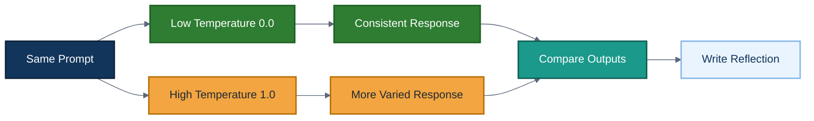
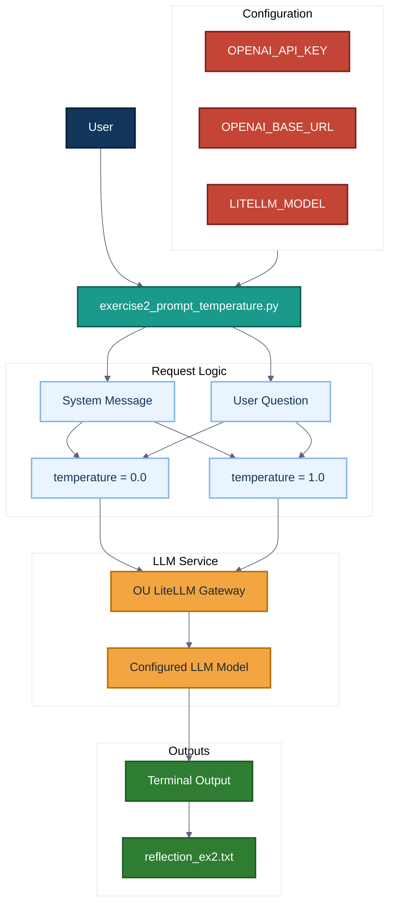
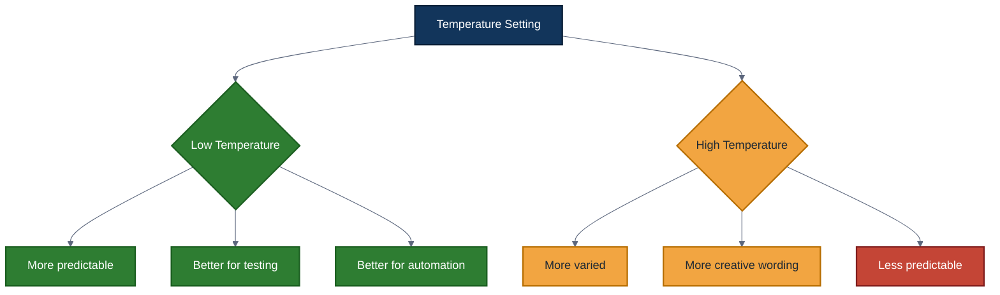
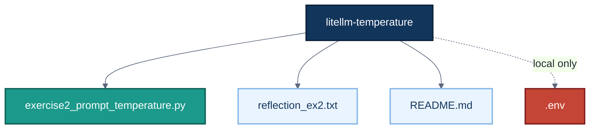

# LiteLLM Temperature Experiment

A Python experiment that demonstrates how the `temperature` setting changes the behavior of Large Language Model responses when calling an LLM through the OU LiteLLM gateway.

This project compares a low-temperature response against a high-temperature response using the same prompt, same model, and same API request structure. The goal is to understand how model creativity, consistency, and predictability change when temperature is adjusted.

## Project Overview

Temperature is a model parameter that controls how predictable or varied an LLM response may be.

In this project:

- Low temperature is set to `0.0`.
- High temperature is set to `1.0`.
- The same system prompt and user question are sent twice.
- The two outputs are printed and compared.
- A reflection file explains which behavior is better for process automation.

For process automation, lower temperature is usually preferred because automated workflows need consistent, repeatable, and testable outputs.

## Features

- Calls an LLM through the OU LiteLLM gateway
- Uses the OpenAI Python client format
- Reads API settings from environment variables
- Compares low-temperature and high-temperature responses
- Prints both responses to the terminal
- Includes a written reflection on the results
- Demonstrates why repeatability matters in automation workflows

## System Workflow



## Architecture



## Temperature Comparison



## Project Structure



## Files

| File | Purpose |
| --- | --- |
| `exercise2_prompt_temperature.py` | Runs the low-temperature and high-temperature LLM comparison |
| `reflection_ex2.txt` | Explains the observed difference between temperature values |
| `README.md` | Project documentation |

## Technology Stack

| Technology | Purpose |
| --- | --- |
| Python | Main scripting language |
| OpenAI Python client | API client format for LiteLLM-compatible calls |
| OU LiteLLM Gateway | LLM access endpoint |
| Environment variables | Secure configuration for API keys and model settings |
| GitHub | Version control and project hosting |

## Environment Variables

The script expects these environment variables:

```bash
OPENAI_API_KEY=your_api_key_here
OPENAI_BASE_URL=https://litellm.lib.ou.edu/v1
LITELLM_MODEL=global.anthropic.claude-sonnet-4-5-20250929-v1:0
```

Do not commit API keys to GitHub.

Recommended `.gitignore` entries:

```gitignore
.env
venv/
__pycache__/
*.pyc
```

## Setup Instructions

### 1. Clone the Repository

```bash
git clone https://github.com/djdcybersecurity/litellm-temperature.git
cd litellm-temperature
```

### 2. Create a Virtual Environment

On Windows Git Bash:

```bash
python -m venv venv
source venv/Scripts/activate
```

On Linux or macOS:

```bash
python3 -m venv venv
source venv/bin/activate
```

### 3. Install Dependencies

```bash
pip install openai
```

### 4. Set Environment Variables

On Linux, macOS, or Git Bash:

```bash
export OPENAI_API_KEY="your_api_key_here"
export OPENAI_BASE_URL="https://litellm.lib.ou.edu/v1"
export LITELLM_MODEL="global.anthropic.claude-sonnet-4-5-20250929-v1:0"
```

## Usage

Run the script:

```bash
python exercise2_prompt_temperature.py
```

The program will:

1. Load API configuration from environment variables.
2. Send the same prompt with temperature `0.0`.
3. Send the same prompt with temperature `1.0`.
4. Print both responses for comparison.

## Example Output

```text
Using model: global.anthropic.claude-sonnet-4-5-20250929-v1:0
Base URL:    https://litellm.lib.ou.edu/v1

Requesting answer with LOW TEMP = 0.0 ...

Requesting answer with HIGH TEMP = 1.0 ...

================================================================================
LOW TEMP (0.0)
================================================================================
- LLM APIs help automate repetitive text tasks.
- They can summarize, classify, and generate useful outputs.
- They make process automation more flexible.

================================================================================
HIGH TEMP (1.0)
================================================================================
- LLM APIs can turn manual work into smart automated workflows.
- They help systems explain, summarize, and create content on demand.
- They let students build tools that feel more adaptive and creative.
```

## Key Takeaway

For automation workflows, low temperature is usually better because it produces more consistent and repeatable outputs. High temperature can be useful for brainstorming or creative writing, but it is less ideal when a system needs stable behavior.

## Security Notes

- Do not commit API keys.
- Do not paste secrets into screenshots.
- Use environment variables instead of hard-coded credentials.
- Rotate any API key that was accidentally exposed.

## Future Improvements

Potential improvements include:

- Add command-line arguments for temperature values.
- Run multiple trials and compare output variation.
- Save results to a CSV or Markdown report.
- Add a JSON output mode.
- Add automated tests for environment variable loading.
- Compare multiple models with the same prompt.
- Add a chart showing response variation by temperature.

## Author

Developed and maintained by Daren Johnson.
